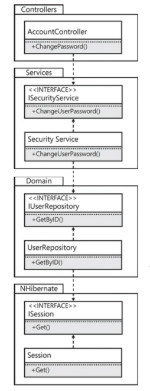
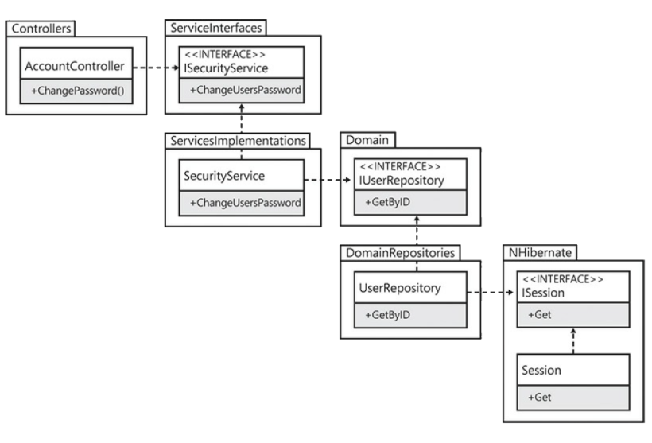

# Stairway Pattern Architecture


🚧 Work in progress. Source code nor documentation can be used yet! 🚧

⚠️ Disclaimer. This is a one-man's project, so its progress is not the fastest one. ⚠️

> Last update 05/01/2021
> 
> Document version 1.2.6
> 
> 
> [](https://opensource.org/licenses/Apache-2.0)
> [](https://sonarcloud.io/dashboard?id=kostasgrevenitis_Codenception.StairwayPatternArchitecture)
> [](https://sonarcloud.io/dashboard?id=kostasgrevenitis_Codenception.StairwayPatternArchitecture)
> 

## Introduction

There is an excellent book called 
[**"Adaptive Code: Agile coding with design patterns and SOLID principles (Developer Best Practices) 2nd Edition"**](https://www.amazon.com/Adaptive-Code-principles-Developer-Practices/dp/1509302581), by Gary McLean Hall.

I am using this book as the basis for this project.

## What is Entourage anti-pattern?

The Entourage anti-pattern in simple Enlgish means that when you invite one, and only one, friend
to your party, we brings his own uninvited friends. This causes undesirable dependency management.
It brings unnecessary dependencies on board.

When we develop a project and add references to another project of conrcrete implementations
with references to other projects of concrete implementations as well, or/and nuget packages too, 
therefore we have to add those references as well. In simple words, in a ASP.NET Web app project, in the bin folder 
you will see the EF related assemblies as implicit dependencies.



## What is Staiway pattern?

The Stairway pattern is useful when we use abstraction (interfaces or abstract classes) 
and dependency inversion. It is applied when the project just depends on other projects 
that have only interfaces. Because of the we can avoid the Entourage anti-pattern. 
Also, those interface only projects should not depend 
on other third party (e.g. nuget) references. It's not possible all the time, 
but it would be good if those projects contain no implementations at all.

Stairway pattern is an orthogonal architecture. "Orthogonality" is a term borrowed from geometry. 
Two lines are orthogonal if they meet at right angles, such as the axes on a graph. 
In vector terms, the two lines are independent. Move along one of the lines, and your 
position projected onto the other doesn't change.

In computing, the term has come to signify a kind of independence or decoupling. Two or
more things are orthogonal if changes in one do not affect any of the others. In a
well-designed system, the database code will be orthogonal to the user interface: you can
change the interface without affecting the database, and swap databases without changing
the interface.

Changes are localized, so development time and testing time are reduced. It is
easier to write relatively small, self-contained components than a single large block
of code. Simple components can be designed, coded, unit tested, and then
forgotten—there is no need to keep changing existing code as you add new code.

An orthogonal approach also promotes reuse. If components have specific,
well-defined responsibilities, they can be combined with new components in ways
that were not envisioned by their original implementors. The more loosely coupled
your systems, the easier they are to reconfigure and reengineer.

There is a fairly subtle gain in productivity when you combine orthogonal
components. Assume that one component does M distinct things and another does
N things. If they are orthogonal and you combine them, the result does M × N
things. However, if the two components are not orthogonal, there will be overlap,
and the result will do less. You get more functionality per unit effort by combining
orthogonal components.

Diseased sections of code are isolated. If a module is sick, it is less likely to spread
the symptoms around the rest of the system. It is also easier to slice it out and
transplant in something new and healthy. The resulting system is less fragile. 
Make small changes and fixes to a particular
area, and any problems you generate will be restricted to that area.

You will not be as tightly tied to a particular vendor, product, or platform, because
the interfaces to these third-party components will be isolated to smaller parts of the
overall development.



# Prerequisites

- [.NET version 5.0.1 SDK](https://dotnet.microsoft.com/download/dotnet/5.0)
- [Identity server](https://identityserver.io/)
- [RabbitMQ](https://www.rabbitmq.com/), if RabbitMQ messagging implementation is used
- [ElasticSearch](https://www.elastic.co/downloads/elasticsearch), [Kibana](https://www.elastic.co/downloads/kibana) if Serilog + ElasticSearch + Kibana implementation is used

# Nuget dependencies
	
- [Carter](https://www.nuget.org/packages/Carter/)
- [DocumentFormat.OpenXml](https://www.nuget.org/packages/DocumentFormat.OpenXml/)
- [Finbuckle.MultiTenant](https://www.nuget.org/packages/Finbuckle.MultiTenant/)
- [MassTransit](https://www.nuget.org/packages/MassTransit/)
- [Microsoft.Extensions.Caching.Redis](https://www.nuget.org/packages/Microsoft.Extensions.Caching.Redis)
- [NSubstitute](https://www.nuget.org/packages/NSubstitute)
- [NSubstitute.Analyzers.CSharp](https://www.nuget.org/packages/NSubstitute.Analyzers.CSharp/)
- [Serilog](https://www.nuget.org/packages/Serilog/2.10.1-dev-01265)
- [xunit](https://www.nuget.org/packages/xunit/)

# Solution analysis

## Scenario

The template, in order to be functional and provide a solid full set of functionalities, embraces the following scenario:

*"Think of yourself travelling to another city, or country for a bussiness trip. You want a list
of restaraunts available, and some information about them (cost, food quality, timetable, cuisine)."*  

## Technical details

At the moment: 

- The codebase has 13 projects.
  - 2 clients projects
  - 2 unit tests projects
  - 6 interfaces projects
  - 3 implementations projects
 - An appveyor.yml file
- It is layer structured.
- It is tier structured.
- It embraces DI
- Carter template is used instead of ASP.NET Core WebApi template, for the Web API

## Domain namespace

This namespace is related to the agreed upon system behaviours.
In the implementation classes we write the code that is related to the *functional requirements*. 
Each domain entity is assembled by two items:

- An Entity class, that carries the domain (or business) logic
- A Record type item, that carries the data, and each property has a contract attribute for validation

They are immutable and any state changes should only be possible by using methods. 

## Services namespace

A service class is an orchestrator. A stateless object that performs actions.
It includes all the objects and data, and dictates how all of
them will work together.

## Repositories namespace

A repository encapsulates the logic that retrieves the data from a data source.
It mediates between the domain and data mapping layers, acting like an in-memory
domain object collection. The domain must be agnostic to the type of data 
that comprises the data source layer.

## Infrastructure namespace

### Database namespace

All the behaviours in this namespace are related to CRUD operations, no matter if its a
SQL database, or a flat-file database.

### I/O namespace

The namespace is responsible to files retrieving, editing, saving and deleting. 
These files might be persisted in the hard drive or consumed by a web service. 
The implementation for this template, will support .txt and Microsoft Office files.

### Caching namespace

Caching is a technique of storing frequently used data in memory, or memory like infrastructure, 
so that, when the same data is needed next time, it would be directly retrieved from the memory 
instead executing more expensive statements, in order to retrieve the data from the data source.

The cached data will not be available in the following cases:

- If its lifetime expires,
- If the application releases its memory,
- If caching does not take place for some reason.

You can access items in the cache using an indexer and may control the lifetime of objects in the cache and set up links between the cached objects and their physical sources.

This template will support in-memory and Redis caching .

###	Messaging namespace

A message queue is a form of asynchronous service-to-service communication. 
Messages are stored on the queue until they are processed and deleted. 
Message queues can be used to decouple heavyweight processing, to buffer or batch work, 
and to smooth spiky workloads.

This template will support in-memory and RabbitMq messaging.

# Extension methods

## Mappers
Mapper are in charge of mapping data from one object to another. This allows the domain
to be isolated by the data structures the client app uses, and the data structures the repositories use.
The isolated domain is easier to be unit tested by the programmers, and the solution structure 
is more scalable this ways.

# Database schema

Rules of thumb
- No null values allowed in the database

# DevOps

## CI

### Appveyor

appveyor.yml

```yaml
version: '1.0.{build}'
image: Visual Studio 2019
branches:
  only:
  - main
init:
  # Good practise, because Windows line endings are different from Unix/Linux ones
  - cmd: git config --global core.autocrlf true
#install:
  # Install repo specific stuff here
before_build:
  # Display .NET Core version
  - cmd: dotnet --version
  # Display minimal restore text
  - cmd: dotnet restore 
build_script:
  - cmd: dotnet publish
#after_build:
  # For once the build has completed
#artifacts:
# - path: '\src\bin\Debug\netcoreapp1.1\publish'
#   name: WebSite
#   type: WebDeployPackage
clone_depth: 1
test_script:
  # restore packages for our unit tests
  - cmd: dotnet restore
  - cmd: dotnet test
#on_finish :
  # any cleanup in here
deploy: off
```

### Github actions

main.yml
```yaml
name: Build main branch
on:
  push:
    branches:
      - main
  pull_request:
    types: [opened, synchronize, reopened]
jobs:
  build:
    name: Build
    runs-on: windows-latest
    steps:
      - uses: actions/checkout@v2
      - name: Setup .NET
        uses: actions/setup-dotnet@v1
        with:
          dotnet-version: 5.0.101
      - name: Restore dependencies
        run: dotnet restore
      - name: Build
        run: dotnet build --no-restore
      - name: Test
        run: dotnet test --no-build --verbosity normal
      - name: Set up JDK 11
        uses: actions/setup-java@v1
        with:
          java-version: 1.11
      - uses: actions/checkout@v2
        with:
          fetch-depth: 0  # Shallow clones should be disabled for a better relevancy of analysis
      - name: Cache SonarCloud packages
        uses: actions/cache@v1
        with:
          path: ~\sonar\cache
          key: ${{ runner.os }}-sonar
          restore-keys: ${{ runner.os }}-sonar
      - name: Cache SonarCloud scanner
        id: cache-sonar-scanner
        uses: actions/cache@v1
        with:
          path: .\.sonar\scanner
          key: ${{ runner.os }}-sonar-scanner
          restore-keys: ${{ runner.os }}-sonar-scanner
      - name: Install SonarCloud scanner
        if: steps.cache-sonar-scanner.outputs.cache-hit != 'true'
        shell: powershell
        run: |
          New-Item -Path .\.sonar\scanner -ItemType Directory
          dotnet tool update dotnet-sonarscanner --tool-path .\.sonar\scanner
      - name: Build and analyze
        env:
          GITHUB_TOKEN: ${{ secrets.GITHUB_TOKEN }}  # Needed to get PR information, if any
          SONAR_TOKEN: ${{ secrets.SONAR_TOKEN }}
        shell: powershell
        run: |
          .\.sonar\scanner\dotnet-sonarscanner begin /k:"kostasgrevenitis_Codenception.StairwayPatternArchitecture" /o:"kostasgrevenitis-github" /d:sonar.login="${{ secrets.SONAR_TOKEN }}" /d:sonar.host.url="https://sonarcloud.io"
          dotnet build
          .\.sonar\scanner\dotnet-sonarscanner end /d:sonar.login="${{ secrets.SONAR_TOKEN }}"
```

## Codecov

-- TODO --

# How to use it

## Implement a feature

1. If Web Api client is used, create a controller class and the related DTO class(es)
2. Create a service class
3. Create an entity class, a record item and a validator class
4. Create a repository class
5. Create a data model class
6. Create the source access class
7. Add them into the Autofac IoC container, into the Startup.cs or Program.cs class

Always include
- Unit tests
- Integration tests

## Implement a behaviour

For each namespace we have the interfaces and the method signatures.
So based on our needs, we can develop **different** concrete implementantion based on 
the desired requirements, by making sure we use the same methods signatures 
provided by the interfaces.

This ensures that programmers don't name the methods based on whatever they like, but they follow
a common pattern. It also ensures higher code quality, better unit testing and easier code review.


# Features roadmap

| Features  | Description |	Version|
| ------------- | ------------- |--|
| Exceptions  | TODO  | 0.2.0.0 |
| To json  | TODO  | 0.3.0.0|
| Data source access  | Implementation with Dapper  | 0.4.0.0|
| Authentication/Authorization/Roles  | Implementation with IdentityServer  | 0.5.0.0 |
| Caching management  | - Implementation with InMemory cache <br/> - Implementation with Redis   | 0.5.0.0 |
| IO management  | Microsoft Office files management with DocumentFormat.OpenXml  | 0.6.0.0 |
| Logging  | - Implementation with Serilog to files <br/> - Implementation with Serilog, ElasticSearch, Kibana  | 0.7.0.0 |
| UI project  | UI project built with Blazor  | 0.8.0.0 |
| Programmer's documentation  | Implementation with DocxFx  | 0.9.0.0 |
| Docker/Containers  | TODO  | 1.0.0.0 |
| Messaging management  | Implementation with MassTransit  | 1.1.0.0 |
| Multitenant support (extra feature)  | Implementation with Finbuckle.MultiTenant  | 2.0.0.0 |

# Versions

[Semantic versioning](https://semver.org/) is used

<details>
  <summary>0.1.0.0</summary>
  Building the scaffold
</details>
